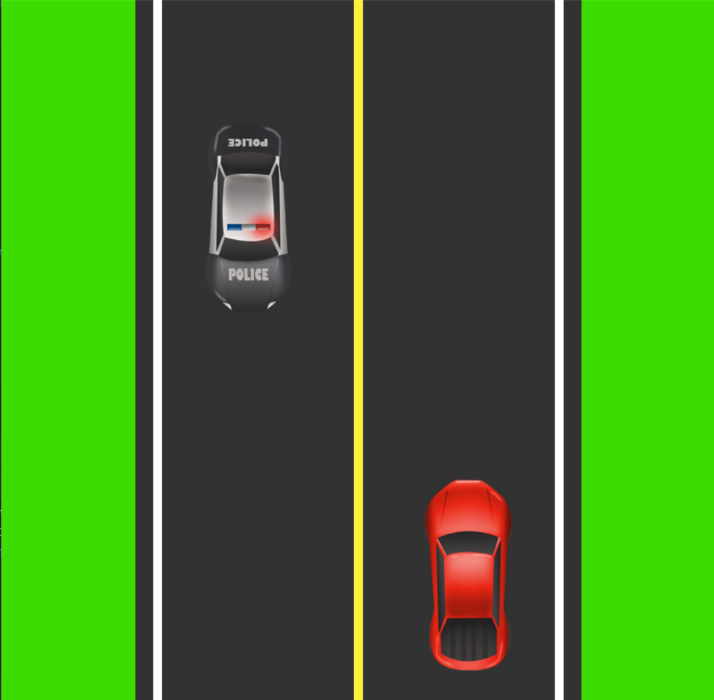

# Car-Game

This is a simple car game developed using Pygame, a popular game development library in Python. In this game, the player controls a car and tries to avoid obstacles while collecting rewards. The objective is to achieve the highest score possible.

# Requirements

To run this game, you need to have the following installed:

Python 3 (version 3.6 or later)
Pygame library (version 1.9.6 or later)

# Instructions

- Use the left and right arrow keys to move the car horizontally.
- Avoid colliding with obstacles, as it will end the game.
- The game will get progressively faster as your score increases, so be prepared for a challenge.

# Acknowledgments

The game was developed following a tutorial on Pygame. Special thanks to the Pygame community and the tutorial author for providing valuable resources.

Feel free to modify and enhance the game according to your needs. Happy gaming!
